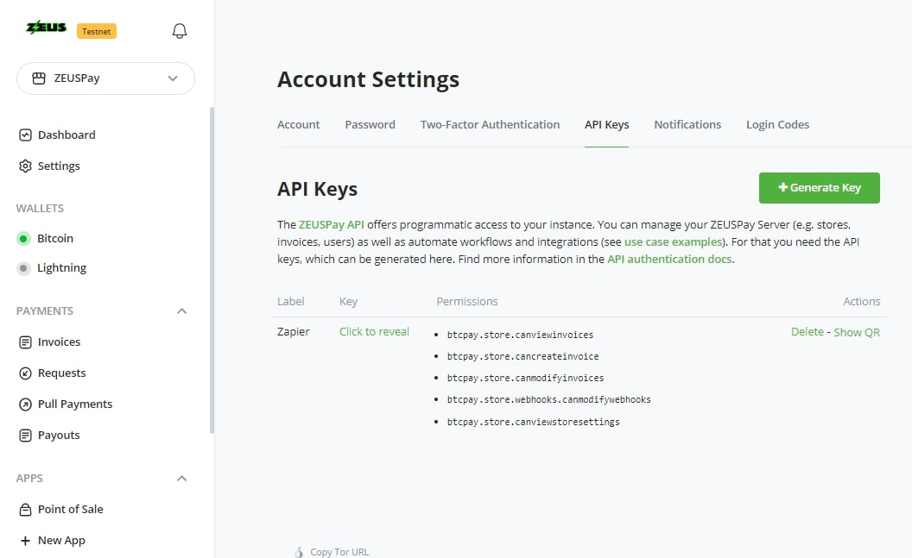

# Easy Automation for ZEUSPay using Zapier.com - No Programming Skills Required

ZEUSPay can be automated in an unlimited number of ways by using it in a [Zapier](https://zapier.com) workflow.
Zapier is a simple tool for non-technical people to set up automations, simply by connecting blocks.

## Free to Use
The ZEUSPay Zapier integration is free to use, but you do need a Zapier.com account.
A free account lets you process 100 actions a month and have 3 workflows called "Zaps".

## What does it do?
The ZEUSPay integration on Zapier defines a number of triggers that can be used to tell other applications what to do. You can chain multiple actions and create an entire workflow.
Besides triggers, there is also a list of actions to make ZEUSPay do something you want. This can be creating an invoice, for example. In this case the trigger can be something happening on ZEUSPay or in another app or because you received an email.

A simple automation looks like this:

## Who is it for?
Zapier is an easy way for non-technical people to automate their workflow. It is also highly flexible and allows you to experiment.

If you are expecting heavy loads however, hiring a developer and building your own custom integration may be cheaper in the long run.

## Some Examples
- When an invoice is paid in ZEUSPay, automatically send a "Thank You" email.
- When an invoice is settled, create a payment in your accounting software.
- When an invoice is paid in ZEUSPay, wait 7 days and then automatically send an email to ask your customer to write a review for your store.
- At the end of the day, automatically move 75% of your funds from a hot wallet to you cold wallet.
- When an invoice expires, notify your sales team by sending a message in Slack.
- Automatically add customer email addresses to your Mailchimp account or other newsletter system.
- Automatically create a new payment request when a row is inserted in a Google Spreadsheet + send the payment link to your customer via email.

## Getting Started
Head over to the [integrations documentation](https://zapier.com/apps/zeuspay/integrations) to get started. You will see some examples here + a list of all triggers and actions we support.

## Requirements
- An account at Zapier.com (free or paid)
- A ZEUSPay instance where you have 1 or more stores
- An API key that has access to the store and resources you want to automate (BEWARE: Never grant more permissions than is absolutely needed!). See below which permissions you should pick for your API key.

## Security Considerations
With great power comes great responsibility. So when you automate your ZEUSPay, you should consider the things that could go wrong or get abused if someone were to get hold of your API Key.
Because you will be providing Zapier with your API key, we strongly encourage you to create an API key with as little permissions as possible.
If you are only going to automate a single store, make sure the API key only has access to the resources for that specific store.
ZEUSPay allows you to configure access per store, so use it.

## Which permissions should I choose for my API key?
Choosing permissions depends on what you are going to do with Zapier. This list helps you make some choices.

If you want to use **triggers**, you will need to have the permission `btcpay.store.webhooks.canmodifywebhooks`. It is easy to overlook this one, but Zapier gets its triggers from a webhook, so that must be allowed.

For the various actions we have, you will need different permissions, like if you want to create or modify an invoice, you will need the `btcpay.store.cancreateinvoice` and `btcpay.store.canmodifyinvoices` permissions.

Viewing stores and invoices is also a good idea to add anyway, so those would be `btcpay.store.canviewinvoices` and `btcpay.store.canviewstoresettings`.

A good place to start would be these permissions:

## How does it work technically?
- Every trigger registers its own webhook in the store it is for. There are no global webhooks in ZEUSPay, only ones per store.
- The webhook only handles the single event it is created for.
- When you enable the Zap, the webhook is automatically created in ZEUSPay and when you disable, the webhook is deleted.
- Each webhook uses its own secret, randomly generated by ZEUSPay.
- The webhook's request signature `BTCPay-Sig` is used to verify the identity of the sender.

## Troubleshooting

### I got a 403 Forbidden error, what happened?
You are most likely using an API key that does not have the required permissions. If you are using any of the triggers in Zapier, always make sure you have the `btcpay.store.webhooks.canmodifywebhooks` permission.

### I deleted the webhook from my ZEUSPay store by mistake.
No worries. Just turn your Zap off and on again and the webhook will automatically be recreated in ZEUSPay.

## Source Code, Issues and Feature Requests
The Zapier integration source code is available on GitHub at the [ZEUSPay Zapier repository](https://github.com/zeuspayments/zapier).
You can also log issues here and ask for missing features.
Issues can also be reported through Zapier as you encounter them.

## Credits and Support
The ZEUSPay Zapier integration was developed by [ZEUSPay](https://www.zeuspay.com).

This repository contains the Zapier integration for ZEUSPay.
The Zapier integration allows you to use triggers from ZEUSPay (like when a new invoice was created, paid or expired) to trigger actions in other systems, like send an email, post a chat message, etc.
